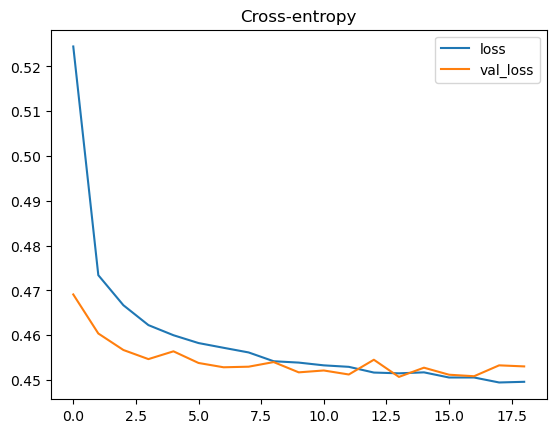
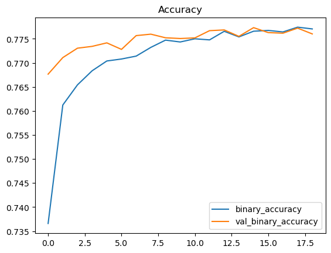

```python

import pandas as pd
pd.set_option('display.max_rows', 500)
pd.set_option('display.max_columns', 500)
train=pd.read_csv('./train.csv')
train.head()
```


<div>
<style scoped>
    .dataframe tbody tr th:only-of-type {
        vertical-align: middle;
    }

    .dataframe tbody tr th {
        vertical-align: top;
    }

    .dataframe thead th {
        text-align: right;
    }
</style>
<table border="1" class="dataframe">
  <thead>
    <tr style="text-align: right;">
      <th></th>
      <th>id</th>
      <th>age</th>
      <th>height(cm)</th>
      <th>weight(kg)</th>
      <th>waist(cm)</th>
      <th>eyesight(left)</th>
      <th>eyesight(right)</th>
      <th>hearing(left)</th>
      <th>hearing(right)</th>
      <th>systolic</th>
      <th>relaxation</th>
      <th>fasting blood sugar</th>
      <th>Cholesterol</th>
      <th>triglyceride</th>
      <th>HDL</th>
      <th>LDL</th>
      <th>hemoglobin</th>
      <th>Urine protein</th>
      <th>serum creatinine</th>
      <th>AST</th>
      <th>ALT</th>
      <th>Gtp</th>
      <th>dental caries</th>
      <th>smoking</th>
    </tr>
  </thead>
  <tbody>
    <tr>
      <th>0</th>
      <td>0</td>
      <td>55</td>
      <td>165</td>
      <td>60</td>
      <td>81.0</td>
      <td>0.5</td>
      <td>0.6</td>
      <td>1</td>
      <td>1</td>
      <td>135</td>
      <td>87</td>
      <td>94</td>
      <td>172</td>
      <td>300</td>
      <td>40</td>
      <td>75</td>
      <td>16.5</td>
      <td>1</td>
      <td>1.0</td>
      <td>22</td>
      <td>25</td>
      <td>27</td>
      <td>0</td>
      <td>1</td>
    </tr>
    <tr>
      <th>1</th>
      <td>1</td>
      <td>70</td>
      <td>165</td>
      <td>65</td>
      <td>89.0</td>
      <td>0.6</td>
      <td>0.7</td>
      <td>2</td>
      <td>2</td>
      <td>146</td>
      <td>83</td>
      <td>147</td>
      <td>194</td>
      <td>55</td>
      <td>57</td>
      <td>126</td>
      <td>16.2</td>
      <td>1</td>
      <td>1.1</td>
      <td>27</td>
      <td>23</td>
      <td>37</td>
      <td>1</td>
      <td>0</td>
    </tr>
    <tr>
      <th>2</th>
      <td>2</td>
      <td>20</td>
      <td>170</td>
      <td>75</td>
      <td>81.0</td>
      <td>0.4</td>
      <td>0.5</td>
      <td>1</td>
      <td>1</td>
      <td>118</td>
      <td>75</td>
      <td>79</td>
      <td>178</td>
      <td>197</td>
      <td>45</td>
      <td>93</td>
      <td>17.4</td>
      <td>1</td>
      <td>0.8</td>
      <td>27</td>
      <td>31</td>
      <td>53</td>
      <td>0</td>
      <td>1</td>
    </tr>
    <tr>
      <th>3</th>
      <td>3</td>
      <td>35</td>
      <td>180</td>
      <td>95</td>
      <td>105.0</td>
      <td>1.5</td>
      <td>1.2</td>
      <td>1</td>
      <td>1</td>
      <td>131</td>
      <td>88</td>
      <td>91</td>
      <td>180</td>
      <td>203</td>
      <td>38</td>
      <td>102</td>
      <td>15.9</td>
      <td>1</td>
      <td>1.0</td>
      <td>20</td>
      <td>27</td>
      <td>30</td>
      <td>1</td>
      <td>0</td>
    </tr>
    <tr>
      <th>4</th>
      <td>4</td>
      <td>30</td>
      <td>165</td>
      <td>60</td>
      <td>80.5</td>
      <td>1.5</td>
      <td>1.0</td>
      <td>1</td>
      <td>1</td>
      <td>121</td>
      <td>76</td>
      <td>91</td>
      <td>155</td>
      <td>87</td>
      <td>44</td>
      <td>93</td>
      <td>15.4</td>
      <td>1</td>
      <td>0.8</td>
      <td>19</td>
      <td>13</td>
      <td>17</td>
      <td>0</td>
      <td>1</td>
    </tr>
  </tbody>
</table>
</div>


```python
train.describe()
```


<div>
<style scoped>
    .dataframe tbody tr th:only-of-type {
        vertical-align: middle;
    }

    .dataframe tbody tr th {
        vertical-align: top;
    }

    .dataframe thead th {
        text-align: right;
    }
</style>
<table border="1" class="dataframe">
  <thead>
    <tr style="text-align: right;">
      <th></th>
      <th>id</th>
      <th>age</th>
      <th>height(cm)</th>
      <th>weight(kg)</th>
      <th>waist(cm)</th>
      <th>eyesight(left)</th>
      <th>eyesight(right)</th>
      <th>hearing(left)</th>
      <th>hearing(right)</th>
      <th>systolic</th>
      <th>...</th>
      <th>HDL</th>
      <th>LDL</th>
      <th>hemoglobin</th>
      <th>Urine protein</th>
      <th>serum creatinine</th>
      <th>AST</th>
      <th>ALT</th>
      <th>Gtp</th>
      <th>dental caries</th>
      <th>smoking</th>
    </tr>
  </thead>
  <tbody>
    <tr>
      <th>count</th>
      <td>159256.000000</td>
      <td>159256.000000</td>
      <td>159256.000000</td>
      <td>159256.000000</td>
      <td>159256.000000</td>
      <td>159256.000000</td>
      <td>159256.000000</td>
      <td>159256.000000</td>
      <td>159256.000000</td>
      <td>159256.000000</td>
      <td>...</td>
      <td>159256.000000</td>
      <td>159256.000000</td>
      <td>159256.000000</td>
      <td>159256.000000</td>
      <td>159256.000000</td>
      <td>159256.000000</td>
      <td>159256.000000</td>
      <td>159256.000000</td>
      <td>159256.000000</td>
      <td>159256.000000</td>
    </tr>
    <tr>
      <th>mean</th>
      <td>79627.500000</td>
      <td>44.306626</td>
      <td>165.266929</td>
      <td>67.143662</td>
      <td>83.001990</td>
      <td>1.005798</td>
      <td>1.000989</td>
      <td>1.023974</td>
      <td>1.023421</td>
      <td>122.503648</td>
      <td>...</td>
      <td>55.852684</td>
      <td>114.607682</td>
      <td>14.796965</td>
      <td>1.074233</td>
      <td>0.892764</td>
      <td>25.516853</td>
      <td>26.550296</td>
      <td>36.216004</td>
      <td>0.197996</td>
      <td>0.437365</td>
    </tr>
    <tr>
      <th>std</th>
      <td>45973.391572</td>
      <td>11.842286</td>
      <td>8.818970</td>
      <td>12.586198</td>
      <td>8.957937</td>
      <td>0.402113</td>
      <td>0.392299</td>
      <td>0.152969</td>
      <td>0.151238</td>
      <td>12.729315</td>
      <td>...</td>
      <td>13.964141</td>
      <td>28.158931</td>
      <td>1.431213</td>
      <td>0.347856</td>
      <td>0.179346</td>
      <td>9.464882</td>
      <td>17.753070</td>
      <td>31.204643</td>
      <td>0.398490</td>
      <td>0.496063</td>
    </tr>
    <tr>
      <th>min</th>
      <td>0.000000</td>
      <td>20.000000</td>
      <td>135.000000</td>
      <td>30.000000</td>
      <td>51.000000</td>
      <td>0.100000</td>
      <td>0.100000</td>
      <td>1.000000</td>
      <td>1.000000</td>
      <td>77.000000</td>
      <td>...</td>
      <td>9.000000</td>
      <td>1.000000</td>
      <td>4.900000</td>
      <td>1.000000</td>
      <td>0.100000</td>
      <td>6.000000</td>
      <td>1.000000</td>
      <td>2.000000</td>
      <td>0.000000</td>
      <td>0.000000</td>
    </tr>
    <tr>
      <th>25%</th>
      <td>39813.750000</td>
      <td>40.000000</td>
      <td>160.000000</td>
      <td>60.000000</td>
      <td>77.000000</td>
      <td>0.800000</td>
      <td>0.800000</td>
      <td>1.000000</td>
      <td>1.000000</td>
      <td>114.000000</td>
      <td>...</td>
      <td>45.000000</td>
      <td>95.000000</td>
      <td>13.800000</td>
      <td>1.000000</td>
      <td>0.800000</td>
      <td>20.000000</td>
      <td>16.000000</td>
      <td>18.000000</td>
      <td>0.000000</td>
      <td>0.000000</td>
    </tr>
    <tr>
      <th>50%</th>
      <td>79627.500000</td>
      <td>40.000000</td>
      <td>165.000000</td>
      <td>65.000000</td>
      <td>83.000000</td>
      <td>1.000000</td>
      <td>1.000000</td>
      <td>1.000000</td>
      <td>1.000000</td>
      <td>121.000000</td>
      <td>...</td>
      <td>54.000000</td>
      <td>114.000000</td>
      <td>15.000000</td>
      <td>1.000000</td>
      <td>0.900000</td>
      <td>24.000000</td>
      <td>22.000000</td>
      <td>27.000000</td>
      <td>0.000000</td>
      <td>0.000000</td>
    </tr>
    <tr>
      <th>75%</th>
      <td>119441.250000</td>
      <td>55.000000</td>
      <td>170.000000</td>
      <td>75.000000</td>
      <td>89.000000</td>
      <td>1.200000</td>
      <td>1.200000</td>
      <td>1.000000</td>
      <td>1.000000</td>
      <td>130.000000</td>
      <td>...</td>
      <td>64.000000</td>
      <td>133.000000</td>
      <td>15.800000</td>
      <td>1.000000</td>
      <td>1.000000</td>
      <td>29.000000</td>
      <td>32.000000</td>
      <td>44.000000</td>
      <td>0.000000</td>
      <td>1.000000</td>
    </tr>
    <tr>
      <th>max</th>
      <td>159255.000000</td>
      <td>85.000000</td>
      <td>190.000000</td>
      <td>130.000000</td>
      <td>127.000000</td>
      <td>9.900000</td>
      <td>9.900000</td>
      <td>2.000000</td>
      <td>2.000000</td>
      <td>213.000000</td>
      <td>...</td>
      <td>136.000000</td>
      <td>1860.000000</td>
      <td>21.000000</td>
      <td>6.000000</td>
      <td>9.900000</td>
      <td>778.000000</td>
      <td>2914.000000</td>
      <td>999.000000</td>
      <td>1.000000</td>
      <td>1.000000</td>
    </tr>
  </tbody>
</table>
<p>8 rows × 24 columns</p>
</div>


```python
import pandas as pd
import numpy as np
from sklearn.model_selection import train_test_split
from sklearn.preprocessing import StandardScaler, OneHotEncoder
from sklearn.impute import SimpleImputer
from sklearn.pipeline import make_pipeline
from sklearn.compose import make_column_transformer
from sklearn.compose import make_column_selector

transformer_num = make_pipeline(
    SimpleImputer(strategy="constant"), # there are a few missing values
    StandardScaler(),
)

preprocessor = make_column_transformer(
    (StandardScaler(),
     make_column_selector(dtype_include=np.number)),
    (OneHotEncoder(sparse=False),
     make_column_selector(dtype_include=object)),
)

X = train.copy()
y = X.pop('smoking')


X_train, X_valid, y_train, y_valid = \
    train_test_split(X, y, stratify=y, train_size=0.75)

X_train = preprocessor.fit_transform(X_train)
X_valid = preprocessor.transform(X_valid)

input_shape = [X_train.shape[1]]

```


```python
from tensorflow import keras
from tensorflow.keras import layers

# YOUR CODE HERE: define the model given in the diagram
model = keras.Sequential([
    layers.BatchNormalization(input_shape=input_shape),
    layers.Dense(units=512,activation='relu'),
    layers.BatchNormalization(),
    layers.Dropout(0.3),
  
    layers.Dense(units=256,activation='relu'),
    layers.BatchNormalization(),
    layers.Dropout(0.3),
  
    layers.Dense(units=256,activation='relu'),
    layers.BatchNormalization(),
    layers.Dropout(0.3),
  
    layers.Dense(units=256,activation='relu'),
    layers.BatchNormalization(),
    layers.Dropout(0.3),
  
    layers.Dense(units=256,activation='relu'),
    layers.BatchNormalization(),
    layers.Dropout(0.3),
    layers.Dense(1,activation='sigmoid')
])


model.compile(
    optimizer='adam',
    loss='binary_crossentropy',
    metrics=['binary_accuracy'],
)

early_stopping = keras.callbacks.EarlyStopping(
    patience=5,
    min_delta=0.001,
    restore_best_weights=True,
)
history = model.fit(
    X_train, y_train,
    validation_data=(X_valid, y_valid),
    batch_size=512,
    epochs=200,
    callbacks=[early_stopping],
)

history_df = pd.DataFrame(history.history)
history_df.loc[:, ['loss', 'val_loss']].plot(title="Cross-entropy")
history_df.loc[:, ['binary_accuracy', 'val_binary_accuracy']].plot(title="Accuracy")
```

    Epoch 1/200
    234/234 [==============================] - 3s 11ms/step - loss: 0.5244 - binary_accuracy: 0.7366 - val_loss: 0.4691 - val_binary_accuracy: 0.7676
    Epoch 2/200
    234/234 [==============================] - 2s 11ms/step - loss: 0.4734 - binary_accuracy: 0.7612 - val_loss: 0.4604 - val_binary_accuracy: 0.7711
    Epoch 3/200
    234/234 [==============================] - 2s 11ms/step - loss: 0.4667 - binary_accuracy: 0.7654 - val_loss: 0.4567 - val_binary_accuracy: 0.7730
    Epoch 4/200
    234/234 [==============================] - 2s 11ms/step - loss: 0.4623 - binary_accuracy: 0.7683 - val_loss: 0.4547 - val_binary_accuracy: 0.7734
    Epoch 5/200
    234/234 [==============================] - 3s 11ms/step - loss: 0.4600 - binary_accuracy: 0.7704 - val_loss: 0.4564 - val_binary_accuracy: 0.7741
    Epoch 6/200
    234/234 [==============================] - 3s 11ms/step - loss: 0.4582 - binary_accuracy: 0.7708 - val_loss: 0.4538 - val_binary_accuracy: 0.7728
    Epoch 7/200
    234/234 [==============================] - 3s 11ms/step - loss: 0.4572 - binary_accuracy: 0.7714 - val_loss: 0.4528 - val_binary_accuracy: 0.7757
    Epoch 8/200
    234/234 [==============================] - 3s 11ms/step - loss: 0.4562 - binary_accuracy: 0.7732 - val_loss: 0.4530 - val_binary_accuracy: 0.7760
    Epoch 9/200
    234/234 [==============================] - 3s 11ms/step - loss: 0.4542 - binary_accuracy: 0.7747 - val_loss: 0.4540 - val_binary_accuracy: 0.7752
    Epoch 10/200
    234/234 [==============================] - 3s 11ms/step - loss: 0.4539 - binary_accuracy: 0.7743 - val_loss: 0.4517 - val_binary_accuracy: 0.7751
    Epoch 11/200
    234/234 [==============================] - 3s 12ms/step - loss: 0.4533 - binary_accuracy: 0.7750 - val_loss: 0.4521 - val_binary_accuracy: 0.7752
    Epoch 12/200
    234/234 [==============================] - 3s 11ms/step - loss: 0.4529 - binary_accuracy: 0.7748 - val_loss: 0.4512 - val_binary_accuracy: 0.7767
    Epoch 13/200
    234/234 [==============================] - 3s 11ms/step - loss: 0.4517 - binary_accuracy: 0.7766 - val_loss: 0.4545 - val_binary_accuracy: 0.7768
    Epoch 14/200
    234/234 [==============================] - 3s 11ms/step - loss: 0.4515 - binary_accuracy: 0.7754 - val_loss: 0.4507 - val_binary_accuracy: 0.7755
    Epoch 15/200
    234/234 [==============================] - 3s 11ms/step - loss: 0.4517 - binary_accuracy: 0.7766 - val_loss: 0.4527 - val_binary_accuracy: 0.7773
    Epoch 16/200
    234/234 [==============================] - 3s 11ms/step - loss: 0.4506 - binary_accuracy: 0.7767 - val_loss: 0.4512 - val_binary_accuracy: 0.7763
    Epoch 17/200
    234/234 [==============================] - 3s 11ms/step - loss: 0.4506 - binary_accuracy: 0.7764 - val_loss: 0.4508 - val_binary_accuracy: 0.7762
    Epoch 18/200
    234/234 [==============================] - 3s 11ms/step - loss: 0.4494 - binary_accuracy: 0.7774 - val_loss: 0.4533 - val_binary_accuracy: 0.7772
    Epoch 19/200
    234/234 [==============================] - 3s 12ms/step - loss: 0.4496 - binary_accuracy: 0.7770 - val_loss: 0.4530 - val_binary_accuracy: 0.7760


    <Axes: title={'center': 'Accuracy'}>


    

    


    

    


```python
# Predict on test
test=pd.read_csv('./test.csv')
test.head()
```


<div>
<style scoped>
    .dataframe tbody tr th:only-of-type {
        vertical-align: middle;
    }

    .dataframe tbody tr th {
        vertical-align: top;
    }

    .dataframe thead th {
        text-align: right;
    }
</style>
<table border="1" class="dataframe">
  <thead>
    <tr style="text-align: right;">
      <th></th>
      <th>id</th>
      <th>age</th>
      <th>height(cm)</th>
      <th>weight(kg)</th>
      <th>waist(cm)</th>
      <th>eyesight(left)</th>
      <th>eyesight(right)</th>
      <th>hearing(left)</th>
      <th>hearing(right)</th>
      <th>systolic</th>
      <th>relaxation</th>
      <th>fasting blood sugar</th>
      <th>Cholesterol</th>
      <th>triglyceride</th>
      <th>HDL</th>
      <th>LDL</th>
      <th>hemoglobin</th>
      <th>Urine protein</th>
      <th>serum creatinine</th>
      <th>AST</th>
      <th>ALT</th>
      <th>Gtp</th>
      <th>dental caries</th>
    </tr>
  </thead>
  <tbody>
    <tr>
      <th>0</th>
      <td>159256</td>
      <td>40</td>
      <td>165</td>
      <td>70</td>
      <td>84.0</td>
      <td>1.2</td>
      <td>1.2</td>
      <td>1</td>
      <td>1</td>
      <td>130</td>
      <td>89</td>
      <td>107</td>
      <td>200</td>
      <td>186</td>
      <td>49</td>
      <td>115</td>
      <td>14.2</td>
      <td>1</td>
      <td>0.9</td>
      <td>19</td>
      <td>25</td>
      <td>32</td>
      <td>0</td>
    </tr>
    <tr>
      <th>1</th>
      <td>159257</td>
      <td>80</td>
      <td>160</td>
      <td>60</td>
      <td>93.0</td>
      <td>1.0</td>
      <td>1.0</td>
      <td>2</td>
      <td>2</td>
      <td>144</td>
      <td>72</td>
      <td>93</td>
      <td>172</td>
      <td>158</td>
      <td>35</td>
      <td>104</td>
      <td>13.0</td>
      <td>1</td>
      <td>1.1</td>
      <td>20</td>
      <td>12</td>
      <td>24</td>
      <td>0</td>
    </tr>
    <tr>
      <th>2</th>
      <td>159258</td>
      <td>60</td>
      <td>170</td>
      <td>70</td>
      <td>86.5</td>
      <td>0.6</td>
      <td>0.7</td>
      <td>1</td>
      <td>1</td>
      <td>117</td>
      <td>75</td>
      <td>92</td>
      <td>161</td>
      <td>173</td>
      <td>39</td>
      <td>88</td>
      <td>15.4</td>
      <td>1</td>
      <td>1.4</td>
      <td>38</td>
      <td>60</td>
      <td>36</td>
      <td>0</td>
    </tr>
    <tr>
      <th>3</th>
      <td>159259</td>
      <td>40</td>
      <td>160</td>
      <td>50</td>
      <td>67.0</td>
      <td>0.3</td>
      <td>0.4</td>
      <td>1</td>
      <td>1</td>
      <td>116</td>
      <td>62</td>
      <td>91</td>
      <td>213</td>
      <td>47</td>
      <td>75</td>
      <td>128</td>
      <td>14.5</td>
      <td>1</td>
      <td>0.6</td>
      <td>25</td>
      <td>18</td>
      <td>10</td>
      <td>1</td>
    </tr>
    <tr>
      <th>4</th>
      <td>159260</td>
      <td>40</td>
      <td>170</td>
      <td>75</td>
      <td>89.4</td>
      <td>1.0</td>
      <td>0.9</td>
      <td>1</td>
      <td>1</td>
      <td>132</td>
      <td>94</td>
      <td>79</td>
      <td>170</td>
      <td>100</td>
      <td>39</td>
      <td>123</td>
      <td>16.5</td>
      <td>1</td>
      <td>1.0</td>
      <td>30</td>
      <td>39</td>
      <td>27</td>
      <td>1</td>
    </tr>
  </tbody>
</table>
</div>


```python
test_df = preprocessor.transform(test)
```


```python
from tensorflow.keras.models import Sequential, save_model, load_model
# Save the model
filepath = './saved_model'
save_model(model, filepath)
```

    INFO:tensorflow:Assets written to: ./saved_model/assets


    INFO:tensorflow:Assets written to: ./saved_model/assets


```python
predictions = model.predict(test_df)

```

    3318/3318 [==============================] - 2s 681us/step


```python
# predictions
```


```python
sub=test[['id']]
df = pd.DataFrame(predictions, columns=['smoking'])
submission=pd.concat([sub, df], axis=1)
submission.to_csv('submission.csv',index=False)
```


```python
prediction_classes = [
    1 if prob > 0.5 else 0 for prob in np.ravel(predictions)
]

```


    [1, 0, 0, 0, 1, 1, 0, 0, 0, 0, 1, 0, 0, 0, 0, 1, 1, 1, 0, 0]


```python

```
